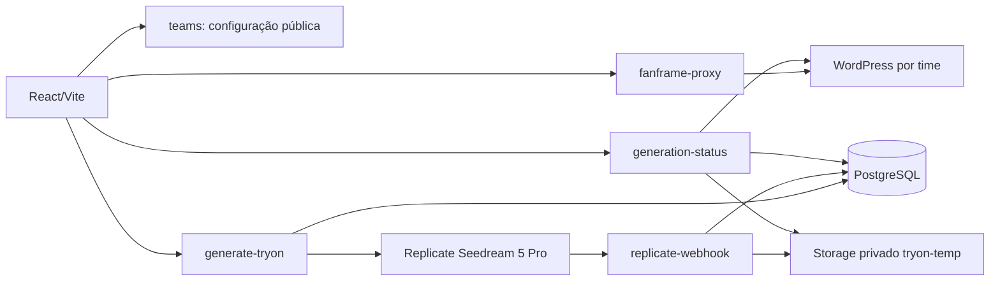

# Arquitetura

`src/app/App.tsx` monta as rotas. `/:slug` resolve apenas times ativos, carrega branding e assets públicos e exibe o provador em `src/features/tryon`. `/admin/*` exige Supabase Auth e papel admin. A rota de upload é `/admin/upload-assets`.

`src/app/TeamPage.tsx` compõe resolução do time e provador; `src/features/teams` contém somente configuração pública, `src/features/auth` contém sessão/créditos e `src/integrations/supabase/functions.ts` concentra as chamadas Edge compartilhadas. Assim, `tryon` depende de `auth` e `teams`, enquanto `admin` usa autenticação sem criar dependência circular entre funcionalidades.

O navegador lê `teams`, incluindo `purchase_urls`, mas nunca lê `team_secrets`. O token Replicate pertence a `team_secrets`; sessões WordPress ficam em `fanframe_sessions` como hash SHA-256 do app token. Links de teste são validados na função, e seus créditos são reservados em transação. A fila e os resultados exigem dono e time; apenas funções com service role modificam registros. O bucket `tryon-temp` é privado e retorna URLs assinadas curtas. O bucket `tryon-assets` armazena imagens públicas dos times, com upload administrativo.

Uma geração recebe UUID do cliente e `request_hash` da seleção e foto. `reserve_generation` bloqueia por time/dono, limita frequência, verifica saldo e evita reserva duplicada. O Replicate chama `replicate-webhook`; assinatura, tempo e prediction ID são verificados antes de armazenar o resultado. Para WordPress, `generation-status` chama `/credits/debit` com o mesmo `generation_id` antes de liberar a imagem; o contrato WordPress deve garantir idempotência. Para testes, o crédito já foi reservado e falhas o devolvem. O navegador consulta `generation-status` até concluir; histórico usa o mesmo endpoint com autenticação.

`supabase/migrations` é o histórico versionado. Migrações antigas preservam a evolução do banco; a última migração revoga políticas legadas de leitura pública. Os tipos em `src/integrations/supabase/types.ts` devem acompanhar o schema implantado.
